# DSC-Phase-3-project
## ProjectSyriaTel Customer Churn Prediction

### Business Understanding

SyriaTel, a telecommunications company, is facing customer churn issues. Customer churn, the act of customers discontinuing services, is a critical problem impacting revenue. The Chief Marketing Officer aims gain insight from us to predict and reduce churn rates to enhance customer loyalty and revenue growth.

## Business Problem

The primary stakeholder for this project is the Chief Marketing Officer (CMO) of SyriaTel. The CMO is responsible for overseeing the company's marketing strategies and customer retention efforts. By identifying patterns of customer churn, the CMO can implement targeted marketing campaigns and retention strategies to minimize churn rates and enhance customer loyalty.

### Objectives

1. Identify causes of customer churn.
2. Predict customer churn rates.
3. Reduce customer churn rates.

#### Data Understanding
The project utilizes the SyriaTel Customer Churn dataset, containing information on customer attributes and churn status.

#### Data Preparation and Cleaning
No missing values were found in the dataset.
No duplicates were present, simplifying the data cleaning process.

#### Visualizations

Visualizations were used to understand the data and identify trends before modeling.

Distribution of Churned vs Non-Churned Customers
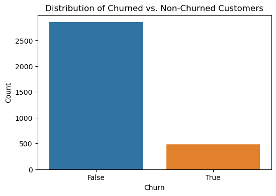
We have a higher number of customers that do not churn compared to customers that do churn which is a good sign.

Churn Rate by State
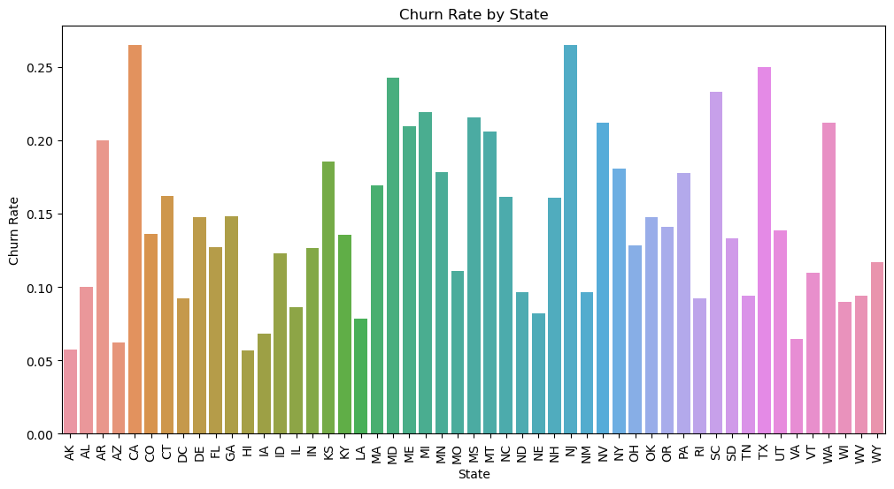

Churn Rate by International Plan
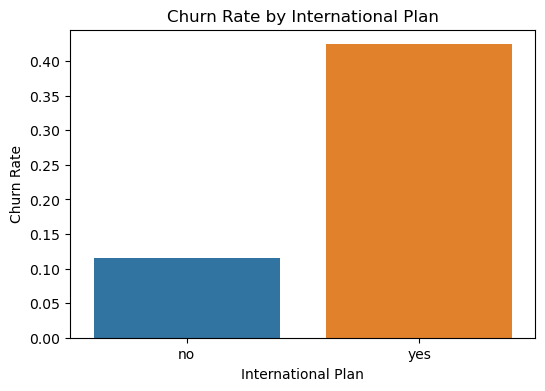
International Plans seem to have a higher churn rate than the national one.

Customer service vs churn
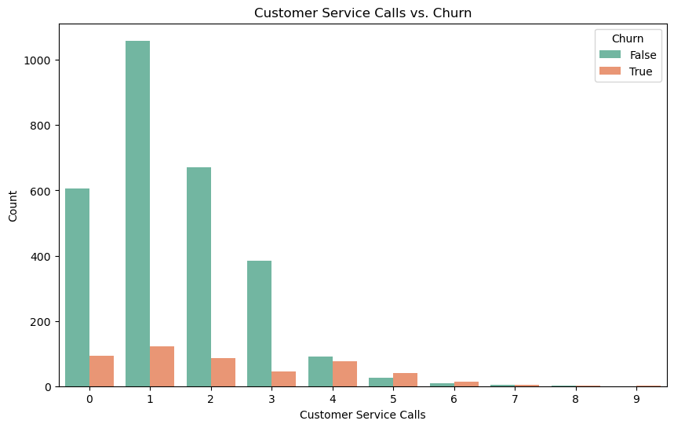
The higher the number of customer service calls the less likely a customer is to churn.

Churn Rate by voice mail plan
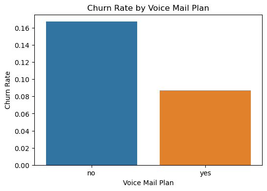
There seems to be an unusually high number of customers that are on the voice mail plan that churn.

Churn Rate over account length
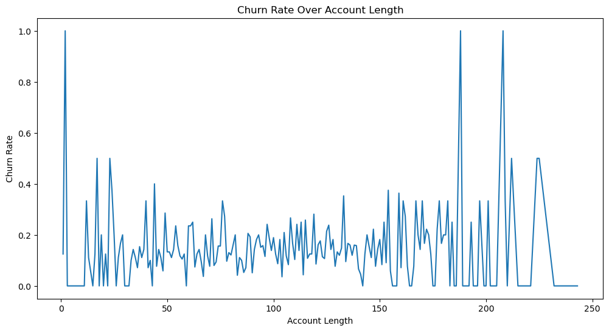
Churn rate seems to be the highest when the account is newest then decreases for the period between 25 - 175 but increases the older the account gets at around 200

Correlation heatmap
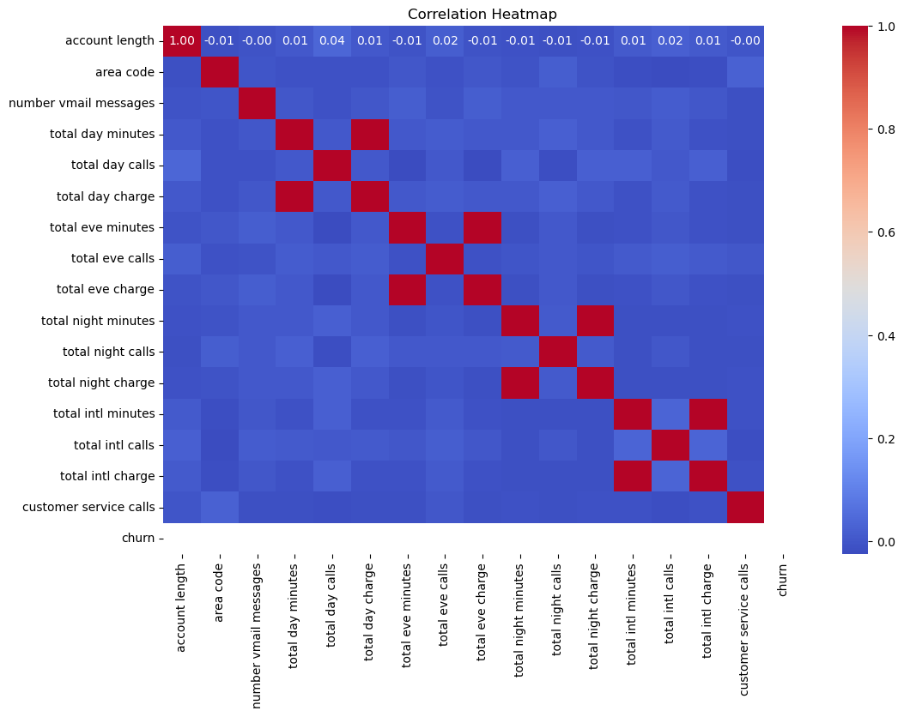
The correlation heatmap indicates that there is no strong correlation between customer churn and any other numerical features in the dataset, with all correlation coefficients near zero. This suggests that churn is not directly influenced by any single numerical factor in the dataset.

### Modelling
For modelling we created 3 models a logistic regression model and 2 xgboost models. This is how the logistic regression model performed:

Cross-Validation Accuracy: 0.7824

Cross-Validation Precision: 0.7776

Cross-Validation Recall: 0.7912

Cross-Validation F1 Score: 0.7842

Cross-Validation ROC AUC Score: 0.8441

Test Set Accuracy: 0.7811

Test Set Precision: 0.3869

Test Set Recall: 0.7624

Test Set F1 Score: 0.5133

Test Set ROC AUC Score: 0.8295

This is how the confusion matrix and ROC AUC curve looked for the logistic regression model.
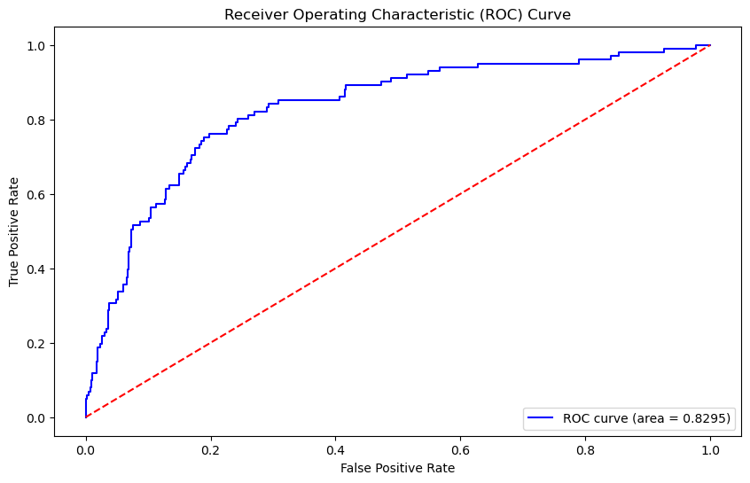
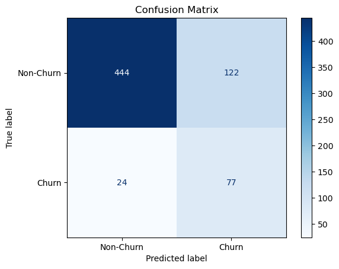

The cross-validation metrics are generally consistent, indicating that the model performs well during training and validation. The slightly lower performance on the test set suggests some overfitting.

The ROC AUC scores indicate that the model has good discriminatory power both during cross-validation and on the test set. The decline in F1 score on the test set suggests the need for further tuning or additional features to improve the balance between precision and recall.

This is how the first xgboost model performed:
Cross-Validation Accuracy: 0.9715

Cross-Validation Precision: 0.9804

Cross-Validation Recall: 0.9623

Cross-Validation F1 Score: 0.9713

Cross-Validation ROC AUC Score: 0.9915

XGBoost - Test Set Accuracy: 0.9580

XGBoost - Test Set Precision: 0.9101

XGBoost - Test Set Recall: 0.8020

XGBoost - Test Set F1 Score: 0.8526

XGBoost - Test Set ROC AUC Score: 0.9261

This is how the confusion matrix and ROC AUC curve looked for the first xgboost model.
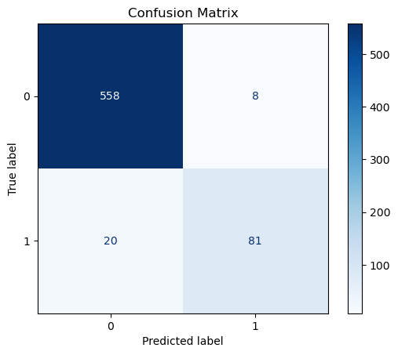
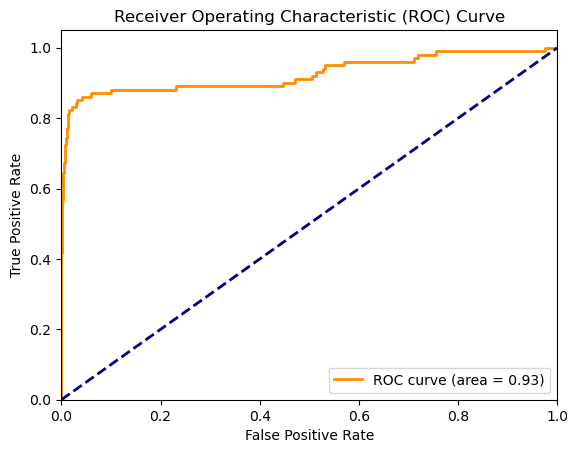

The XGBoost model performs impressively, showing high accuracy (97.15%) during cross-validation and showing solid precision (98.04%) and recall (96.23%), indicating its efficiency for spotting churn instances accurately. On the test set, it maintains an acceptable accuracy of 95.80% and demonstrates decent precision (91.01%) and recall (80.20%), affirming its reliability in practical scenarios.

Finally this is how the second model with the adjusted parameters performed.
Cross-Validation Accuracy: 0.9726

Cross-Validation Precision: 0.9800

Cross-Validation Recall: 0.9650

Cross-Validation F1 Score: 0.9724

Cross-Validation ROC AUC Score: 0.9919

Test Set Accuracy: 0.9580

Test Set Precision: 0.9011

Test Set Recall: 0.8119

Test Set F1 Score: 0.8542

Test Set ROC AUC Score: 0.9229

The performance is almost identical to the first xgboost model.

This is how the confusion matrix and ROC AUC curve looked for the adjusted xgboost model.

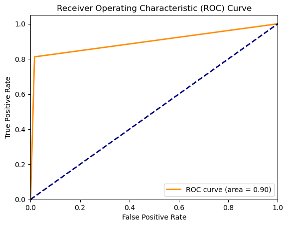

### Final Evaluation

We have built 3 different models a logistic regression model and two xgboost models. Based on the performance of the models the best model to go with is either the first or the second xgboost model with the revised parameters. Looking at the accuracy, precision, recall, F1 score and ROC AUC score there is almost nothing to differentiate the two. But after looking at the ROC AUC curve of both models, the initial xgboost is the better model to use due to the fact that the ROC curve is closer to the top left corner than the second model. In addition to that it also has a slightly better ROC curve Area.

So for this project I will recommend using the first xgboost model, not the one with the adjusted parameters.

# Recommendations

#### Explaining Causes of Customer Churn:

International Plan: Customers with an international plan are more likely to churn. This could be due to high costs or dissatisfaction with the plan.

Total Day Minutes: Higher usage during the day might correlate with churn, possibly indicating that high-usage customers are more sensitive to service quality or pricing.

Voice Mail Plan: Customers without a voice mail plan are less likely to churn, suggesting that the voice mail plan might not be meeting customer needs.

Customer Service Calls: Customers that receive frequent customer service calls(above 5) are less likely to churn, suggesting that Syriel should increase the number of customer service calls that they make.

#### Predicting Churn:
The xgboost model that we will be using achieves an accuracy of 96% and a ROC AUC score of 92%, indicating strong predictive power and the model's ability to discriminate between classes eliminating bias

#### Reducing Churn:
Focus retention efforts on customers with high predicted churn probabilities, offering tailored incentives and improving service quality in identified areas. 
Which can be done by offering a more incentivized international plan package e.g with better rates. Ensure high quality services to customers that use the product the most as they bring in the most money and losing them would cost the company a lot. Offer a voice mail plan to more customers as it is seen that they are less likely to churn. Finally, communicate with the customers through customer service calls as you can be able to gain their feedback and implement what they are suggesting. As it is seen that churn rate reduces as customer service calls increase.

